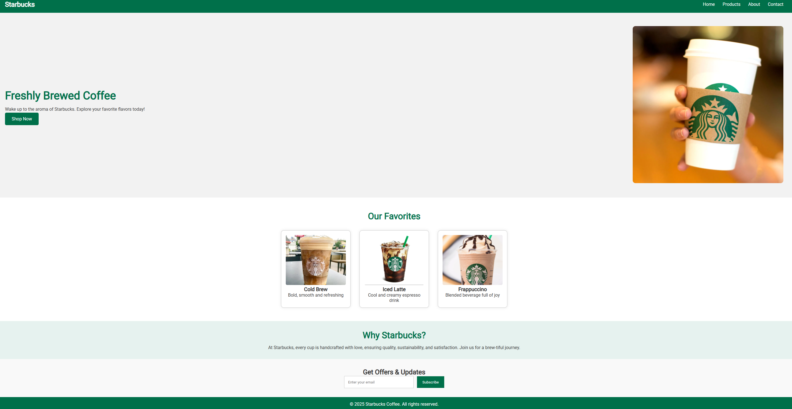

# ☕ Starbucks Landing Page

This is **Task 2** of my Web Development Internship at **CodSoft**.  
I have created a **responsive and visually appealing landing page** inspired by **Starbucks** using HTML, CSS, and JavaScript.

---

## 🔗 Live Demo

🌐 [View Live Project](https://your-netlify-or-vercel-link.com)

---

## 📌 Features

- ✅ Clean and modern design inspired by Starbucks branding
- ✅ Fully responsive layout for mobile, tablet, and desktop
- ✅ Smooth scroll and hover effects
- ✅ Interactive navigation bar
- ✅ Call-to-action buttons and product section

---

## 🛠️ Technologies Used

- HTML5  
- CSS3  
- JavaScript (vanilla)  

---

## 📸 Screenshots

---

## 📁 Folder Structure

