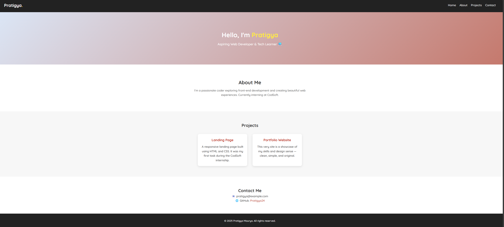

# 🧑‍💻 Personal Portfolio Website - CodSoft Internship

This project is submitted as **Task 2** for the **CodSoft Web Development Internship - July 2025**.  
It is a personal **Portfolio Website** built using **HTML and CSS**, showcasing my skills and projects.

---

## 🔗 Live Preview

🌍 [GitHub Pages Link](https://your-github-username.github.io/Web_Development_Task2/)  
📁 [View Repository](https://github.com/your-github-username/Web_Development_Task2)

---

## ✨ Features

- Clean and elegant landing page design 🎨  
- About section with brief introduction 🙋‍♀️  
- Projects section with cards 🛠️  
- Contact section with email and GitHub link 💌  
- Fully responsive layout (optional) 📱  
- 100% original code (no template used) ✅

---

## 📁 Tech Stack

| Tool | Description |
|------|-------------|
| HTML5 | Markup language for structure |
| CSS3 | Styling, layout, responsiveness |
| Google Fonts | Custom typography |
| GitHub Pages | Project hosting |

---
## Preview 

