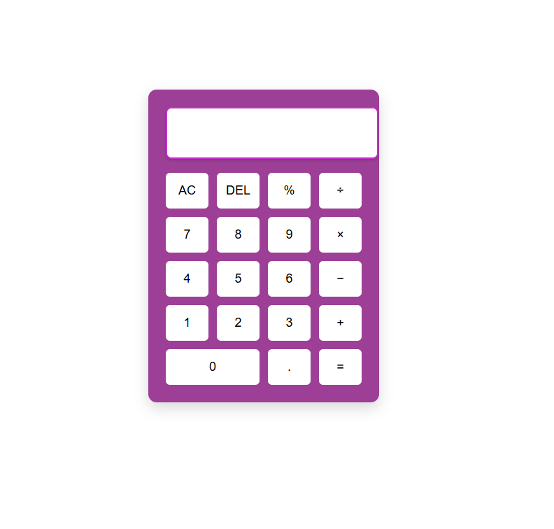

This Project is a part of codsoft web development submission by Pratigya.
# Calculator Web App

This is a simple and interactive calculator built using **HTML**, **CSS**, and **JavaScript**.  
It performs basic arithmetic operations like addition, subtraction, multiplication, division, and modulus.

## 💡 Features
- Fully functional calculator layout
- Stylish and responsive UI
- Light-weight design
- Supports keyboard and mouse input

## 🛠️ Tech Stack
- HTML5
- CSS3
- JavaScript (Vanilla)

## 📸 Preview

## 🚀 How to Use
1. Clone the repository
2. Open `index.html` in any browser
3. Start calculating!

## 🔗 Project Link
[Click here to view the GitHub repo](https://github.com/Pratigya24/CODSOFT)

---

> Task 3 of Web Development Internship - **CodSoft**
